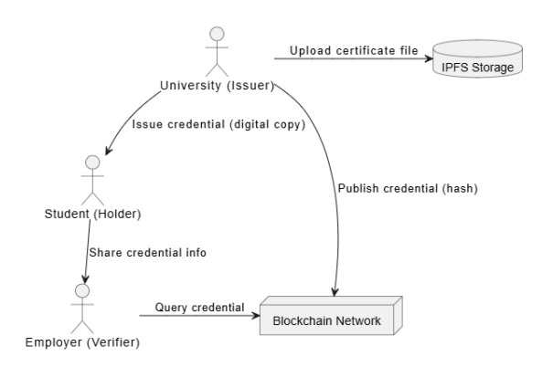

# 🎓 Blockchain-Based Academic Credential Ecosystem

A **decentralized academic credential management and verification system** that leverages **blockchain technology and IPFS** to securely issue, store, and verify academic certificates.
The system eliminates credential fraud, reduces verification time, and gives students ownership of their academic records.

---

## 📌 Problem Statement

Traditional academic credential systems suffer from:
- Centralized control and single points of failure

- High verification time and manual processes

- Credential forgery and lack of trust

- Dependency on issuing institutions for verification

This project addresses these challenges using a **blockchain-powered, trustless architecture.**

---

## 💡 Solution Overview

The system enables:

- **Universities** to issue tamper-proof digital credentials

- **Students** to own and share their credentials

- **Employers / Verifiers** to instantly verify credentials without intermediaries

Key technologies used:

- **Blockchain** for immutability and trust

- **IPFS** for decentralized document storage

- **Cryptographic hashing** for integrity verification

---

## 🏗️ System Architecture

The architecture separates on-chain verification from off-chain storage to ensure scalability, privacy, and cost efficiency.

### Architecture Flow

**1. University (Issuer)**

- Uploads the certificate file to IPFS

- Generates a cryptographic hash of the credential

- Publishes the hash to the blockchain via a smart contract

**2. Student (Holder)**

- Receives the digital credential

- Shares credential information (IPFS hash / reference) with verifiers

**3. Employer (Verifier)**

- Queries the blockchain for the credential hash

- Fetches the document from IPFS

- Verifies authenticity by matching hashes

**4. Blockchain Network**

- Stores immutable credential proofs

- Ensures trustless and transparent verification

--- 

## 🔐 Key Features

✅ Tamper-proof credentials

✅ Decentralized storage using IPFS

✅ Instant verification without intermediaries

✅ Student-controlled credential sharing

✅ Reduced fraud and verification cost

---

## 🛠️ Technology Stack

- **Blockchain Platform:** EVM-compatible chain

- **Smart Contracts:** Solidity

- **Decentralized Storage:** IPFS

- **Frontend:** React / Web3.js / Ethers.js

- **Wallet Integration:** MetaMask