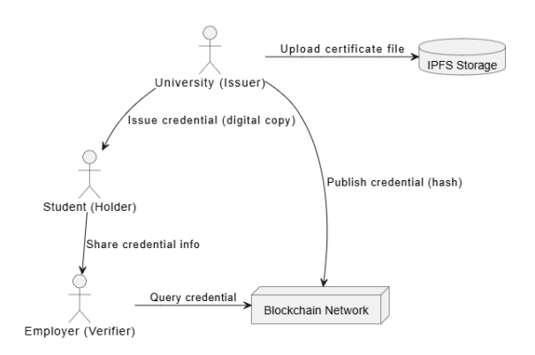

# 🎓 Blockchain-Based Academic Credential Ecosystem

A **decentralized academic credential management and verification system** that leverages **blockchain technology and IPFS** to securely issue, store, and verify academic certificates.
The system eliminates credential fraud, reduces verification time, and gives students ownership of their academic records.

---

## 📌 Problem Statement

Traditional academic credential systems suffer from:
- Centralized control and single points of failure

- High verification time and manual processes

- Credential forgery and lack of trust

- Dependency on issuing institutions for verification

This project addresses these challenges using a **blockchain-powered, trustless architecture.**

---

## 💡 Solution Overview

The system enables:

- **Universities** to issue tamper-proof digital credentials

- **Students** to own and share their credentials

- **Employers / Verifiers** to instantly verify credentials without intermediaries

Key technologies used:

- **Blockchain** for immutability and trust

- **IPFS** for decentralized document storage

- **Cryptographic hashing** for integrity verification

---

## 🏗️ System Architecture

The architecture separates on-chain verification from off-chain storage to ensure scalability, privacy, and cost efficiency.

### Architecture Flow




**1. University (Issuer)**

- Uploads the certificate file to IPFS

- Generates a cryptographic hash of the credential

- Publishes the hash to the blockchain via a smart contract

**2. Student (Holder)**

- Receives the digital credential

- Shares credential information (IPFS hash / reference) with verifiers

**3. Employer (Verifier)**

- Queries the blockchain for the credential hash

- Fetches the document from IPFS

- Verifies authenticity by matching hashes

**4. Blockchain Network**

- Stores immutable credential proofs

- Ensures trustless and transparent verification


--- 

## 🔐 Key Features

✅ Tamper-proof credentials

✅ Decentralized storage using IPFS

✅ Instant verification without intermediaries

✅ Student-controlled credential sharing

✅ Reduced fraud and verification cost

---

## 🛠️ Technology Stack

- **Blockchain Platform:** EVM-compatible chain

- **Smart Contracts:** Solidity

- **Decentralized Storage:** IPFS

- **Frontend:** React / Web3.js / Ethers.js

- **Wallet Integration:** MetaMask

---

## ⚙️ Developer Setup

This repo is a monorepo with two parts:

- **Root** — Hardhat project containing the Solidity contracts, deployment scripts, and tests.
- **`frontend/`** — Vite + React + TypeScript app that talks to the deployed contract and pins certificate files to IPFS via Pinata.

### 1. Prerequisites

Install these on your machine before starting:

- **Node.js** ≥ 20 and **npm** ≥ 10 (check with `node -v` and `npm -v`)
- **Git**
- **MetaMask** browser extension
- An **Ethereum Sepolia RPC URL** (free from [Alchemy](https://alchemy.com) or [Infura](https://infura.io))
- A **funded Sepolia wallet** (get test ETH from [sepoliafaucet.com](https://sepoliafaucet.com))
- A **Pinata** account and JWT API key from [pinata.cloud](https://pinata.cloud) (used to pin certificate PDFs to IPFS)

### 2. Clone and install dependencies

```bash
git clone <this-repo-url> CredChain
cd CredChain

# Hardhat / contract deps (root)
npm install

# Frontend deps
cd frontend
npm install
cd ..
```

> If you ever need to add a new package, run `npm install <pkg>` inside the directory that owns the dependency (root for contract tooling, `frontend/` for UI deps).

### 3. Configure environment variables

Both the root project and the frontend ship with a `.env.example`. Copy each one to `.env` and fill in the values.

**Root `.env`** (used by [`hardhat.config.ts`](./hardhat.config.ts) when deploying):

```bash
cp .env.example .env
```

Then edit `.env`:

```env
SEPOLIA_RPC=https://eth-sepolia.g.alchemy.com/v2/YOUR_API_KEY
DEPLOYER_KEY=0xyour_funded_sepolia_private_key
```

> ⚠️ `DEPLOYER_KEY` must be a 0x-prefixed private key. Never commit it — `.env` is already in `.gitignore`.

**Frontend `frontend/.env`** (read by Vite at build time):

```bash
cp frontend/.env.example frontend/.env
```

Then edit `frontend/.env`:

```env
VITE_CONTRACT_ADDRESS=0xYourDeployedContractAddress   # filled in after deployment (step 5)
VITE_PINATA_JWT=your_pinata_jwt_here
```

### 4. Compile and test the contracts

From the project root:

```bash
# Compiles the Solidity sources into artifacts/
npx hardhat compile

# Optional: run the contract test suite
npx hardhat test
```

The compiled ABI used by the frontend lives at [`frontend/src/abi/AcademicCredential.json`](./frontend/src/abi/AcademicCredential.json). If you ever change the contract, copy the freshly built ABI from `artifacts/contracts/AcademicCredential.sol/AcademicCredential.json` over that file so the frontend stays in sync.

### 5. Deploy the contract to Sepolia

The deployment script for Sepolia lives at [`scripts/deploy-sepolia.ts`](./scripts/deploy-sepolia.ts) — it deploys the `AcademicCredential` contract using the `DEPLOYER_KEY` and `SEPOLIA_RPC` from your root `.env`.

Make sure your `DEPLOYER_KEY` wallet has Sepolia ETH, then run that script with Hardhat:

```bash
npx hardhat run scripts/deploy-sepolia.ts --network sepolia
```

You'll see output like:

```
Deploying from: 0xabc...
✅ Deployed to: 0x1234567890abcdef1234567890abcdef12345678
```

**Copy that deployed address** and paste it into `frontend/.env` as `VITE_CONTRACT_ADDRESS`. The frontend reads this on startup ([`frontend/src/contexts/EthereumContext.tsx`](./frontend/src/contexts/EthereumContext.tsx)) — without it, no contract calls will work.

### 6. Run the frontend

```bash
cd frontend
npm run dev
```

Vite will print a local URL (typically `http://localhost:5173`). Open it in a browser that has MetaMask installed and:

1. Switch MetaMask to the **Sepolia** network.
2. Click **Connect Wallet** in the navbar.
3. The deployer address is automatically the contract admin (it has `DEFAULT_ADMIN_ROLE`) and can register universities at `/universities`. Registered universities can issue credentials at `/issue`. Anyone can verify at `/verify`.

### 7. Production build (optional)

```bash
cd frontend
npm run build      # outputs frontend/dist/
npm run preview    # serves the built site locally
```

### Project layout cheat sheet

| Path | What lives here |
| --- | --- |
| [`contracts/`](./contracts) | Solidity sources (`AcademicCredential.sol`) |
| [`scripts/`](./scripts) | Hardhat deployment scripts |
| [`test/`](./test) | Hardhat test suite |
| [`hardhat.config.ts`](./hardhat.config.ts) | Hardhat + Sepolia network config |
| [`frontend/src/pages/`](./frontend/src/pages) | Page components (Issue, Verify, Revoke, etc.) |
| [`frontend/src/contexts/EthereumContext.tsx`](./frontend/src/contexts/EthereumContext.tsx) | Wallet + contract wiring |
| [`frontend/src/lib/ipfs.ts`](./frontend/src/lib/ipfs.ts) | Pinata IPFS upload helper |
| [`frontend/src/abi/AcademicCredential.json`](./frontend/src/abi/AcademicCredential.json) | Compiled contract ABI used by the UI |

### Common issues

- **`Error HH8: Invalid value undefined for HardhatConfig.networks.sepolia.url`** — your root `.env` is missing or `SEPOLIA_RPC` / `DEPLOYER_KEY` are blank. Even `npx hardhat compile` reads them.
- **`Missing VITE_PINATA_JWT in your environment`** — set `VITE_PINATA_JWT` in `frontend/.env` and restart `npm run dev` (Vite only reads env files on startup).
- **Frontend can't find the contract / role checks fail** — `VITE_CONTRACT_ADDRESS` is wrong or pointing at a different network than MetaMask is on.
- **MetaMask says "internal JSON-RPC error"** — the connected account isn't on Sepolia, or it doesn't have the on-chain role required for the action you're attempting (e.g. only `ISSUER_ROLE` accounts can call `issueCredential`).